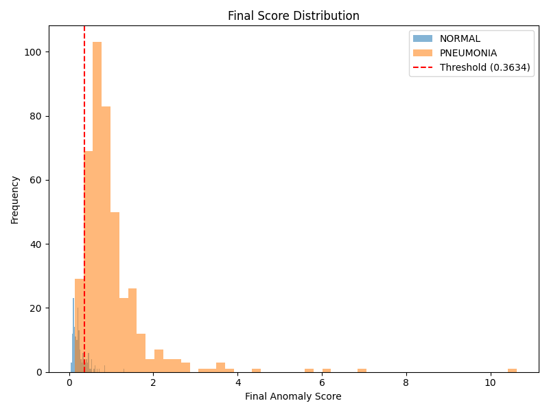
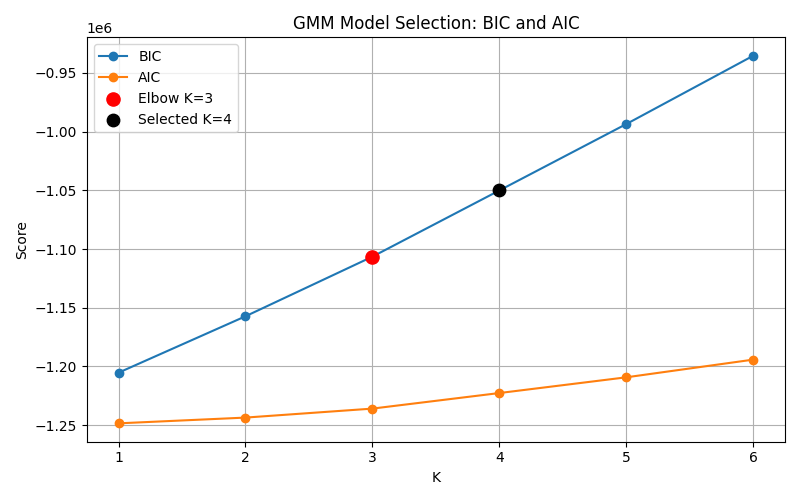

# Chest X-ray Spectral Anomaly Detection

This repository implements an unsupervised chest X-ray anomaly detection pipeline based on a convolutional autoencoder, FFT-derived spectral channels, and Gaussian Mixture Model (GMM) density estimation in latent space.

This project is for research purposes only and is not a medical diagnostic tool.

## Project Overview

The project studies whether pneumonia chest X-rays can be detected as anomalies when the model is trained primarily on normal chest X-rays. The implemented workflow uses the Kaggle-style `chest_xray` folder layout with `NORMAL` and `PNEUMONIA` image folders. Training uses normal images only; evaluation compares normal test images against pneumonia test images.

The core anomaly detection assumption is that an autoencoder trained on normal images should learn a compressed representation of normal lung image structure. A GMM is then fit to the normal latent vectors produced by the encoder. Test samples with low latent-space likelihood under this normal model receive higher anomaly scores.

FFT and spectral features are explored because some image differences are easier to express as changes in frequency content than as raw pixel intensities. In chest radiographs, subtle opacity, texture, edge sharpness, and fine-grained lung-pattern changes may alter higher-frequency components. The high-frequency experiments explicitly suppress low-frequency structure with a circular high-pass mask before computing the log magnitude spectrum.

## Implemented Pipeline

The implemented processing path is:

```text
image
  -> grayscale preprocessing
  -> FFT / spectral processing
  -> 2-channel tensor: [image, spectrum]
  -> autoencoder latent embedding
  -> optional StandardScaler + PCA
  -> GMM latent density model
  -> validation-tail threshold
  -> anomaly prediction
```

### 1. Image loading and preprocessing

`src/dataset.py` defines `ChestXrayDataset`.

For each image:

- Loads the file with Pillow and converts it to grayscale.
- Resizes to the configured square `image_size`.
- Converts to `float32` and normalizes pixels to `[0, 1]`.
- Computes a spectral representation with `compute_log_spectrum`.
- Returns a tensor with shape `(2, image_size, image_size)`.

Channel `0` is the grayscale image. Channel `1` is the normalized log FFT magnitude representation.

### 2. FFT / spectral processing

`src/utils_fft.py` computes:

```text
fft_shifted = fftshift(fft2(image))
log_spectrum = log(1 + abs(fft_shifted))
```

The spectrum is normalized independently per image to `[0, 1]`. In `high_freq` mode, the shifted FFT is multiplied by a circular high-pass mask before log magnitude is computed.

### 3. Autoencoder latent embedding

`src/model.py` implements a convolutional autoencoder with:

- 2-channel input.
- Four strided convolution blocks with batch normalization.
- `AdaptiveAvgPool2d((4, 4))`.
- A linear latent layer of configurable size, defaulting to `latent_dim: 128` in the provided configs.
- A transpose-convolution decoder followed by bilinear upsampling to the configured image size.
- Configurable activation: `relu` or `leaky_relu`.

The latent vector `z = model.encode(x)` is the feature vector used by the downstream GMM.

### 4. Reconstruction loss and reconstruction error

`src/losses.py` implements:

- `mse`
- `energy_normalized_mse`

It also supports two reconstruction targets:

- `all_channels`: reconstruct and score both image and FFT channels.
- `fft_only`: reconstruct and score only the FFT channel.

The current configs use `energy_normalized_mse` and mostly use `fft_only`. During evaluation, per-sample reconstruction error is computed and can be blended into the final anomaly score.

### 5. Optional PCA

`src/evaluate_gmm.py` standardizes latent vectors with `StandardScaler`. If `use_pca: true`, PCA is applied after scaling and before GMM fitting. `pca_n_components` may be a variance ratio such as `0.95` or an integer component count. When PCA is enabled, the evaluator saves `pca_explained_variance.png`.

### 6. GMM latent modeling

The GMM is fit on normal training latent vectors only. Candidate values of `K` are evaluated over the inclusive YAML range `gmm_k_range`.

For each `K`, the evaluator fits:

```python
GaussianMixture(
    n_components=K,
    covariance_type="full",
    random_state=42,
    reg_covar=1e-5,
    n_init=3,
    tol=1e-3,
)
```

The evaluator records BIC and AIC for each candidate in `gmm_model_selection.csv` and plots them in `gmm_bic_aic.png`.

`gmm_selection_method` controls selection:

- `bic`: selects the minimum-BIC model.
- `elbow`: computes an elbow point on the BIC curve and, in the current implementation, sets `best_K = elbow_K + 1`.

The selected scaler, optional PCA model, GMM, and related metadata are saved to `checkpoints/gmm_latent.joblib`.

### 7. Anomaly score and threshold

The GMM anomaly score is:

```text
gmm_score = -gmm.score_samples(z)
```

The final score combines normalized GMM score and normalized reconstruction error:

```text
final_score =
    score_alpha * normalized_gmm_score
    + (1 - score_alpha) * normalized_reconstruction_error
```

Normalization uses the normal validation distribution as the reference range.

The anomaly threshold is the configured upper percentile of `val/NORMAL` final scores:

```text
threshold = percentile(val_normal_final_scores, threshold_percentile)
```

A test sample is predicted anomalous when:

```text
final_score > threshold
```

## Experiment System

Experiments are configured with YAML files in `configs/`. The training and evaluation scripts read these configs, validate required keys, and write reproducibility artifacts.

Each run receives a UTC timestamp and short UUID suffix:

```text
outputs/{YYYYMMDDTHHMMSSZ}_{8_hex_chars}/
```

Run directories contain:

- `config_snapshot.yaml`: config copied at run creation time.
- `params.json`: run parameters and selected evaluation parameters.
- `metrics.json`: training or evaluation metrics.
- `latent_statistics.json`: latent feature summaries saved during evaluation.
- `gmm_model_selection.csv`: BIC/AIC values for candidate GMM component counts.
- `gmm_bic_aic.png`: model-selection plot.
- `plots/gmm_score_hist_threshold.png`: score histogram with threshold.
- `checkpoints/ae.pt`: final autoencoder checkpoint.
- `checkpoints/ae_best.pt`: best-loss autoencoder checkpoint.
- `checkpoints/gmm_latent.joblib`: scaler, optional PCA model, GMM, and scoring metadata.

`src/experiment_utils.py` implements config loading, validation, run directory creation, config snapshots, JSON/YAML saving, and matching an evaluation config back to a compatible existing training run.

`src/tracker_integration.py` optionally logs runs to a local `ml_flow_like` tracker located at:

```text
C:\Users\Public\ml_flow_like
```

If that tracker is unavailable, the code continues and prints a warning. The tracker CLI in `src/experiment_cli.py` can list runs or start the tracker UI.

Benchmark comparison is supported by keeping configs identical except for the spectral settings under comparison, then comparing the saved `metrics.json`, plots, or tracker runs.

## Spectral Modes

The code currently validates only these `spectral_mode` values:

- `full_spectrum`
- `high_freq`

### Full FFT spectrum

`full_spectrum` keeps all FFT coefficients after `fftshift`, then computes normalized `log(1 + abs(FFT))`. This retains both low-frequency global structure and high-frequency detail.

### High-frequency spectrum

`high_freq` applies a circular high-pass mask in the centered FFT plane before log magnitude. Frequencies with normalized radius less than or equal to `high_freq_cutoff_ratio` are removed. This mode emphasizes local detail, texture, and edge-like components.

### Circular high-pass masking

The high-pass mask is implemented in `src/utils_fft.py` by constructing a normalized radius map over `[-1, 1] x [-1, 1]` and keeping coefficients where:

```text
radius > cutoff_ratio
```

### Image-only mode

A true image-only spectral mode is not implemented. `ChestXrayDataset` always returns a two-channel tensor containing both the grayscale image and a computed spectrum. `validate_config` rejects any `spectral_mode` other than `full_spectrum` or `high_freq`.

## Evaluation

`src/evaluate_gmm.py` computes binary anomaly detection metrics where:

- Label `0`: `NORMAL`
- Label `1`: `PNEUMONIA`

The evaluator reports the configured primary `test_subset` and also computes subgroup metrics when samples are available:

- `all_pneumonia`: all `test/PNEUMONIA` images.
- `virus_only`: pneumonia files whose paths contain `virus`.
- `bacteria_only`: pneumonia files whose paths contain `bacteria`.

Saved metrics include:

- ROC-AUC
- PR-AUC
- precision
- recall / sensitivity
- F1
- specificity
- confusion matrix
- row-normalized confusion matrix percentages
- true negatives, false positives, false negatives, true positives
- threshold
- mean GMM score
- mean reconstruction error
- mean final score

Confusion matrices are printed to the console and saved numerically in `metrics.json`; the current code does not save a separate confusion-matrix image.

False negatives are stored as `fn` in `metrics.json`. In this anomaly detection setup, a false negative is a pneumonia image whose final anomaly score does not exceed the threshold learned from normal validation scores.

## Repository Structure

Current project structure, summarized from the repository contents:

```text
.
├── README.md
├── EXPERIMENT_TRACKING.md
├── requirements.txt
├── checkpoints/
│   ├── ae.pt
│   ├── ae_best.pt
│   └── gmm_latent.joblib
├── configs/
│   ├── ae_full_spectrum.yaml
│   ├── ae_full_spectrum_kaggle.yaml
│   ├── ae_high_freq.yaml
│   └── ae_high_freq_kaggle.yaml
├── data/
│   ├── chest_xray/
│   │   ├── train/NORMAL/
│   │   ├── val/NORMAL/
│   │   ├── val/normal_manifest.txt
│   │   └── test/
│   │       ├── NORMAL/
│   │       └── PNEUMONIA/
│   └── chest_xray_kaggle/
│       ├── train/
│       │   ├── NORMAL/
│       │   └── PNEUMONIA/
│       ├── val/
│       │   ├── NORMAL/
│       │   └── PNEUMONIA/
│       └── test/
│           ├── NORMAL/
│           └── PNEUMONIA/
├── outputs/
│   ├── score_histogram.png
│   ├── gmm_score_hist_threshold.png
│   ├── gmm_model_selection.csv
│   ├── gmm_bic_aic.png
│   ├── example_*_label_0.png
│   ├── chest_xray_anomaly_project_architecture.pptx
│   ├── gmm_same_config_flow.docx
│   └── {run_id}/
│       ├── config_snapshot.yaml
│       ├── params.json
│       ├── metrics.json
│       ├── latent_statistics.json
│       ├── gmm_model_selection.csv
│       ├── gmm_bic_aic.png
│       ├── pca_explained_variance.png
│       ├── plots/gmm_score_hist_threshold.png
│       └── checkpoints/
│           ├── ae.pt
│           ├── ae_best.pt
│           └── gmm_latent.joblib
├── scripts/
│   └── create_val_split.py
└── src/
    ├── dataset.py
    ├── evaluate_gmm.py
    ├── experiment_cli.py
    ├── experiment_utils.py
    ├── losses.py
    ├── model.py
    ├── tracker_integration.py
    ├── train_ae.py
    └── utils_fft.py
```

Python bytecode caches and the local `.venv/` directory are present in the working tree but are not part of the source design.

At inspection time, `outputs/` contained 33 timestamped run directories.

## Installation

Create and activate a Python environment, then install the dependencies listed in `requirements.txt`.

```bash
python -m venv .venv
.venv\Scripts\activate
pip install -r requirements.txt
```

Dependencies:

- `torch`
- `torchvision`
- `numpy`
- `scikit-learn`
- `matplotlib`
- `Pillow`
- `joblib`
- `PyYAML`

The repository does not pin dependency versions.

## Dataset Setup

The code expects a Kaggle chest X-ray style directory tree. The dataset used by this project is the Kaggle Chest X-Ray Images (Pneumonia) dataset:

https://www.kaggle.com/datasets/paultimothymooney/chest-xray-pneumonia

Download the dataset from Kaggle and extract it so that the directory containing `train/`, `val/`, and `test/` is placed under one of the configured dataset roots. The default config family uses one of these roots:

- `data/chest_xray`
- `data/chest_xray_kaggle`

For example, after extraction the layout should start like this:

```text
data/chest_xray_kaggle/
├── train/
├── val/
└── test/
```

Expected structure for training and evaluation:

```text
data/chest_xray/
├── train/
│   └── NORMAL/
├── val/
│   └── NORMAL/
└── test/
    ├── NORMAL/
    └── PNEUMONIA/
```

The Kaggle copy currently present also includes pneumonia folders under `train/` and `val/`, but autoencoder training calls `ChestXrayDataset(..., include_pneumonia=False)`, so training uses only `train/NORMAL`.

Current inspected image counts:

```text
data/chest_xray/
  train/NORMAL: 1159
  val/NORMAL: 174
  test/NORMAL: 234
  test/PNEUMONIA: 390

data/chest_xray_kaggle/
  train/NORMAL: 1266
  train/PNEUMONIA: 3418
  val/NORMAL: 158
  val/PNEUMONIA: 427
  test/NORMAL: 159
  test/PNEUMONIA: 428
```

To create a deterministic normal validation split from `train/NORMAL`, use:

```bash
python scripts/create_val_split.py --data_dir data/chest_xray --ratio 0.15 --seed 42
```

This copies selected normal images into `val/NORMAL` and writes `val/normal_manifest.txt`. During training, filenames found in `val/NORMAL` are excluded from `train/NORMAL` to avoid using validation normals as training samples.

## Training Commands

Train with a YAML config:

```bash
python src/train_ae.py --config configs/ae_full_spectrum.yaml
python src/train_ae.py --config configs/ae_high_freq.yaml
python src/train_ae.py --config configs/ae_full_spectrum_kaggle.yaml
python src/train_ae.py --config configs/ae_high_freq_kaggle.yaml
```

Optional CLI overrides implemented by `src/train_ae.py`:

```bash
python src/train_ae.py --config configs/ae_full_spectrum.yaml --data_dir data/chest_xray --epochs 20 --batch_size 32
```

Training creates a new run directory under `outputs/`, saves `ae_best.pt` when loss improves, then writes the final loaded best model to `ae.pt`.

## Evaluation Commands

Evaluate with the matching YAML config:

```bash
python src/evaluate_gmm.py --config configs/ae_full_spectrum.yaml
python src/evaluate_gmm.py --config configs/ae_high_freq.yaml
python src/evaluate_gmm.py --config configs/ae_full_spectrum_kaggle.yaml
python src/evaluate_gmm.py --config configs/ae_high_freq_kaggle.yaml
```

Optional dataset-root override:

```bash
python src/evaluate_gmm.py --config configs/ae_full_spectrum.yaml --data_dir data/chest_xray
```

Evaluation resolves the most recent compatible run directory for the config and expects `checkpoints/ae.pt` to exist. If no compatible trained run exists, the script creates an evaluation run directory but exits with an error if the autoencoder checkpoint is missing.

Tracker utilities:

```bash
python src/experiment_cli.py list
python src/experiment_cli.py ui
```

`ui` starts the local `ml_flow_like` backend and opens `http://127.0.0.1:8000` when that external tracker is installed at the configured path.

## Example Outputs

Representative saved artifacts from an inspected run directory:

```text
outputs/20260514T143009Z_b241f2cc/
├── config_snapshot.yaml
├── params.json
├── metrics.json
├── latent_statistics.json
├── gmm_model_selection.csv
├── gmm_bic_aic.png
├── pca_explained_variance.png
├── plots/gmm_score_hist_threshold.png
└── checkpoints/
    ├── ae.pt
    ├── ae_best.pt
    └── gmm_latent.joblib
```

The root `outputs/` folder also contains earlier standalone plots and example images:

- `score_histogram.png`
- `gmm_score_hist_threshold.png`
- `gmm_bic_aic.png`
- `gmm_model_selection.csv`
- `example_*_label_0.png`

`latent_statistics.json` contains sample counts, feature counts, feature means and standard deviations, aggregate latent statistics, covariance condition number, and variance summaries for raw latent vectors and GMM input vectors.

`metrics.json` contains the selected threshold, ROC-AUC, PR-AUC, recall/sensitivity, false negatives, confusion matrices, and subgroup metrics for `all_pneumonia`, `virus_only`, and `bacteria_only` when available.

## Representative GMM Results

The latest inspected GMM evaluation run is:

```text
outputs/20260514T143009Z_b241f2cc
```

This run used `configs/ae_full_spectrum_kaggle.yaml` with `spectral_mode: full_spectrum`, `image_size: 400`, `latent_dim: 128`, `reconstruction_target: fft_only`, `score_alpha: 0.5`, and `test_subset: bacteria_only`. PCA was disabled for this run.

The selected operating threshold was learned from the normal validation tail:

```text
threshold = 0.3633788434354912
```

Primary `bacteria_only` metrics from `metrics.json`:

| Metric | Value |
| --- | ---: |
| ROC-AUC | 0.9562 |
| PR-AUC | 0.9712 |
| Precision | 0.8969 |
| Recall / sensitivity | 0.9355 |
| F1 | 0.9158 |
| Specificity | 0.8113 |
| False negatives | 18 |
| False positives | 30 |

Confusion matrix for the primary `bacteria_only` subset:

| Actual \ Predicted | Normal | Anomaly |
| --- | ---: | ---: |
| Normal | 129 | 30 |
| Bacteria pneumonia | 18 | 261 |

The same run also stored subgroup metrics for all pneumonia and virus-only evaluation:

| Subset | ROC-AUC | PR-AUC | Recall | F1 | FN |
| --- | ---: | ---: | ---: | ---: | ---: |
| all_pneumonia | 0.9484 | 0.9778 | 0.9299 | 0.9299 | 30 |
| virus_only | 0.9339 | 0.9294 | 0.9195 | 0.8671 | 12 |
| bacteria_only | 0.9562 | 0.9712 | 0.9355 | 0.9158 | 18 |

### Score Histogram

The histogram below shows final anomaly score distributions for normal and pneumonia samples with the selected validation-derived threshold.



### GMM Model Selection

The BIC/AIC curve below is generated from candidate GMM component counts in `gmm_k_range`. For this run, the evaluator recorded `min_bic_K: 1`, `elbow_K: 3`, and selected `best_K: 4` under the implemented elbow policy.



These results demonstrate the behavior of one saved experiment run. They should be treated as dataset-specific research results, not as evidence of clinical diagnostic performance.

## Research Notes

This project is anomaly detection, not supervised pneumonia classification. The autoencoder and GMM are trained to model normal images rather than to learn class-discriminative decision boundaries from labeled pneumonia examples. Pneumonia labels are used for evaluation of anomaly detection behavior.

FFT features may help when abnormalities change local texture or spatial-frequency patterns. A raw image channel preserves anatomical structure and intensity information, while the spectral channel exposes frequency-domain structure to the autoencoder. The high-frequency mode is especially relevant for experiments focused on subtle detail changes, but it can also discard useful low-frequency information.

Dataset limitations matter. The Kaggle chest X-ray dataset is not a clinical deployment dataset, file naming is used to infer virus and bacteria subgroups, and image acquisition differences may become shortcuts for anomaly scores. Results should be interpreted as research measurements on this dataset layout, not as clinical evidence.

Unsupervised evaluation has additional limitations. The threshold is selected from normal validation tails, so operating characteristics depend heavily on the validation split and chosen percentile. A high recall can come with more false positives, and ROC-AUC / PR-AUC do not by themselves define a clinically acceptable operating point.

## Future Work

Realistic extensions compatible with the current codebase include:

- Replace or supplement the autoencoder with a variational autoencoder (VAE).
- Add latent-space visualizations with PCA, t-SNE, or UMAP plots.
- Run systematic spectral ablations across cutoff ratios, image sizes, PCA settings, and `score_alpha`.
- Add Grad-CAM or related attribution methods for supervised comparison models, if a classifier baseline is added.
- Explore diffusion-model reconstruction or likelihood baselines.
- Add multi-scale FFT features so the model can compare frequency content at several image resolutions.
